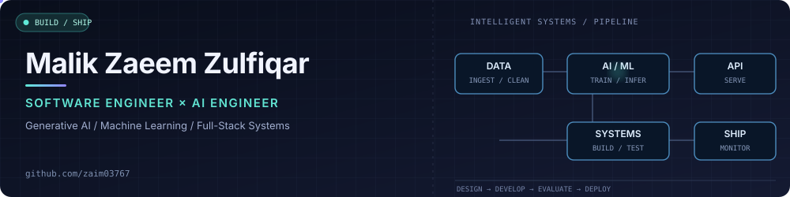

  

  <a href="https://github.com/zaim03767">GitHub</a> ·
  <a href="https://github.com/zaim03767/DIGI">Deepfake Detection</a> ·
  <a href="https://github.com/zaim03767/HVAC-Website">Live Web Project</a>

### About

I'm **Malik Zaeem Zulfiqar**, a software engineer working across **AI, full-stack engineering, and generative systems**. I build practical software, from machine learning pipelines and APIs to usable web applications, with an emphasis on maintainability, testing, and clear interfaces.

My background spans generative 3D workflows, applied machine learning, and software engineering. Currently working as a **Software Engineer at WeTravels**. Previously worked at **OpusAI** and **LoopCreations**.

### Engineering focus

- **Applied AI:** Computer vision, deep learning, predictive modeling, and model evaluation.
- **Software systems:** TypeScript / JavaScript, React, Node.js, Python, backend APIs, databases, authentication, and testing.
- **Generative workflows:** AI-assisted 3D pipelines, Unreal Engine 5, Python automation, and workflow optimization.
- **Engineering habits:** Readable architecture, version control, reproducible workflows, and reliable delivery.

### Selected work

| Project | What it demonstrates |
| :-- | :-- |
| **[DIGI — Deepfake Detection](https://github.com/zaim03767/DIGI)** | Image and video manipulation detection using computer vision, deep learning, Flask, and a web interface. |
| **[Student Stress Detection](https://github.com/zaim03767/student-stress-detection)** | Random Forest-based predictive ML exposed via a Flask REST API. |
| **[HVAC Website](https://github.com/zaim03767/HVAC-Website)** | Responsive React, Vite, and Tailwind CSS website. [Live demo](https://hvac-website-iota.vercel.app/). |
| **[DEN — Machine Learning Internship](https://github.com/zaim03767/DEN)** | Practical ML tasks, data processing, and experimentation from an internship. |

### Tools I work with

`Python` · `TypeScript` · `JavaScript` · `C++` · `React` · `Next.js` · `Node.js` · `Flask` · `Prisma` · `SQL` · `TensorFlow` · `scikit-learn` · `OpenCV` · `Unreal Engine 5` · `Git` · `Vitest` · `Playwright`

### Currently exploring

Reliable AI applications, data-centric machine learning, AI-assisted automation, and scalable software architecture.

---

Build thoughtfully. Test what matters. Ship work that lasts.

